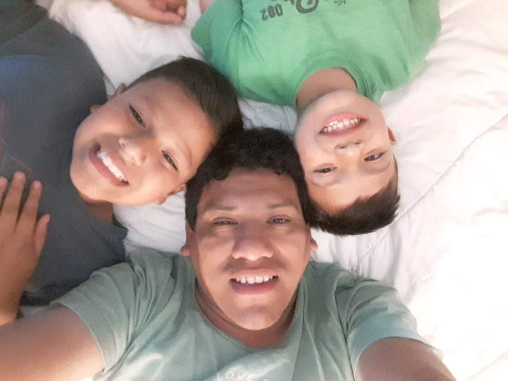
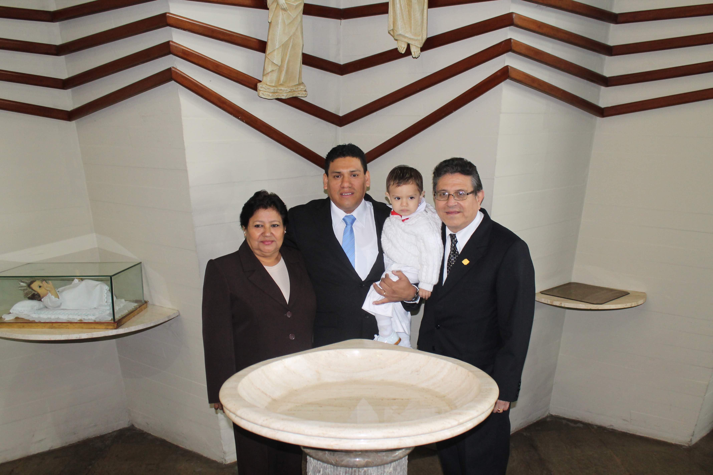
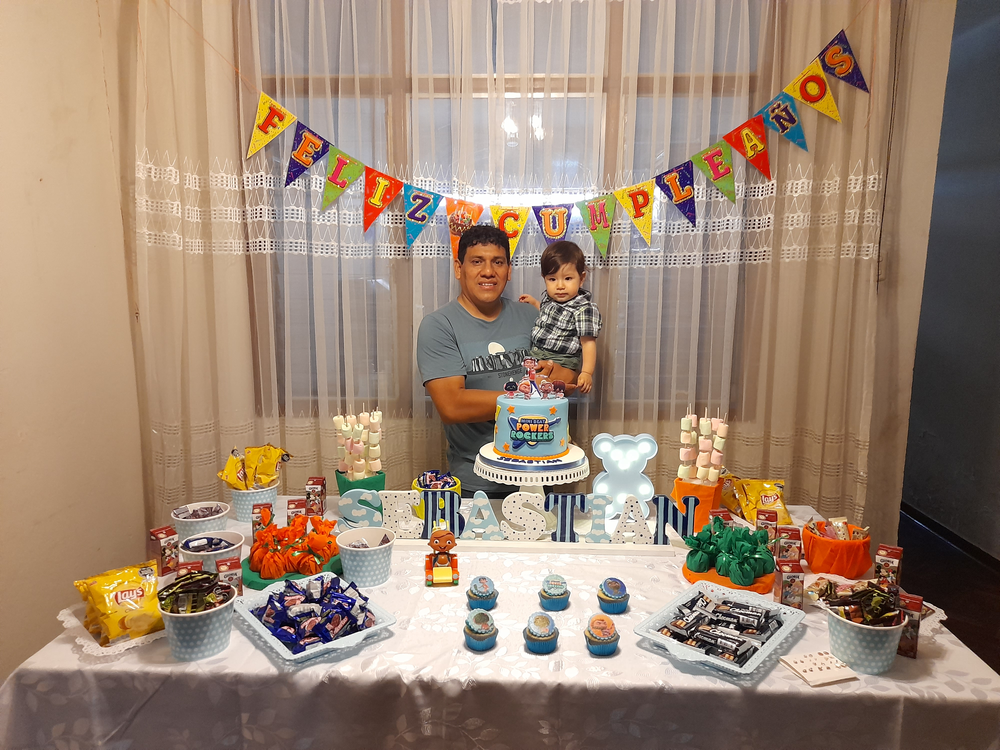

<!DOCTYPE html>  
<html lang="es">  
<head>  
<meta charset="UTF-8">  
<meta name="viewport" content="width=device-width, initial-scale=1.0">  
<title>Feliz Cumpleaños Kalid</title>  
  
  
</head>  
  
<body>  
  
<h1>🎉 ¡Feliz Cumpleaños Papá! 🎉</h1>  
<h2>Kalid — 50 Años 💛</h2>  
  

🎂
  
  
<button onclick="iniciarSorpresa()">Toca aquí papá ❤️</button>  
  

  
  

  
  
  
  

  
  
<audio autoplay loop>  
<source src="https://www2.cs.uic.edu/~i101/SoundFiles/HappyBirthday.mid" type="audio/midi">  
</audio>  
  

Te extrañamos papá 💛
  
  
  
  
</body>  
</html>  
